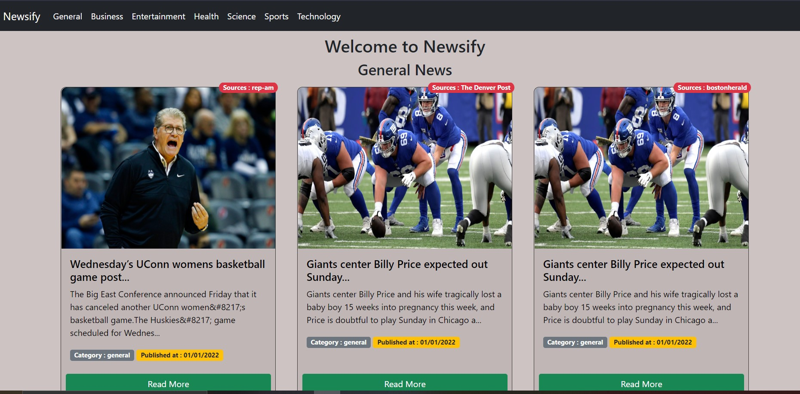
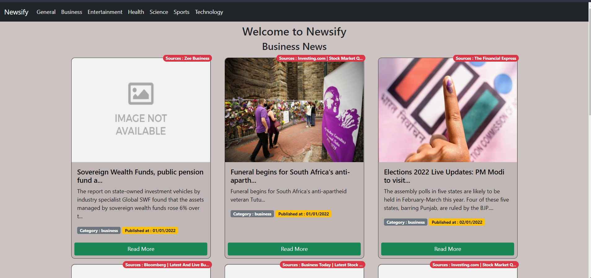
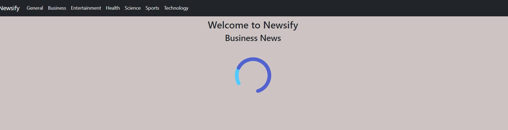

# Newsify

A News Application that fetches news using mediastack api and displays it categorically.
<br>

>**Features implemented :**
- Loader for waiting for waiting while fetching data
- Infinite Scroll for the news application for pagination
- Categorically sseperated data implemented using  react router.

## Setting up the app locally
Clone the application in a directory using :

``` bash
git clone https://github.com/indranil786/newsify.git
```

***To run it locally on you machine you need to have a 
mediastack api key , and place it in .env.local file
<br> You can get your api key at : https://mediastack.com***
<br> N.B : The api key is dynamic is in http instead of https for free account.
<br>

### **.env.local file :** 
``` javascript
REACT_APP_API_KEY=<Mediastack API Key>
```
***To run the application, install all the dependencies by:***
``` javascript
npm i --force
```
***After all the dependecies are installed , run the application by :***
``` javascript
npm start
```
<br>


## **Snapshots of the Application**

## General category
 

## Business Category
 

## Loader
 